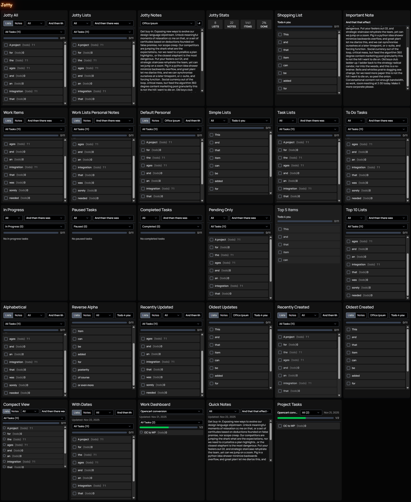

# Jotty Widget for Homepage

Widget for [Homepage](https://gethomepage.dev/) that integrates with [Jotty](https://github.com/fccview/jotty)

## Start with respect

Shoutout to both these devs & communities, please go donate to them.



## Planned Future Updates
Time duration(s)
Pinned items filter

## Configuration Options

| Option | Type | Default | Description |
|--------|------|---------|-------------|
| `url` | string | *required* | URL to your Jotty instance |
| `key` | string | *required* | Your Jotty API key (starts with `ck_`) |
| `show` | string | `"both"` | Display mode: `"both"`, `"lists"`, or `"notes"` |
| `showSummary` | boolean | `false` | Show summary stats instead of list view |
| `listTitle` | string | - | Lock to a specific list by title |
| `noteTitle` | string | - | Lock to a specific note by title |
| `category` | string | - | Filter both lists and notes by category |
| `listCategory` | string | - | Filter only lists by category |
| `noteCategory` | string | - | Filter only notes by category |
| `defaultCategory` | string | `"all"` | Pre-select category in dropdown |
| `listType` | string | - | Filter lists by type: `"simple"` or `"task"` |
| `taskStatus` | string | `"all"` | Default task status filter: `"all"`, `"todo"`, `"in_progress"`, `"paused"`, `"completed"` |
| `hideCompleted` | boolean | `false` | Hide completed items |
| `maxItems` | number | - | Maximum items to display in a list |
| `maxLists` | number | - | Maximum lists/notes in dropdown |
| `sortBy` | string | - | Sort by: `"title"`, `"updated"`, or `"created"` |
| `sortOrder` | string | `"asc"` | Sort order: `"asc"` or `"desc"` |
| `compact` | boolean | `false` | Use compact UI with less padding |
| `showTimestamps` | boolean | `false` | Show last updated dates |

## Examples

### Basic Display Modes

```yaml
# Default (Both lists and notes with all dropdowns)
- Jotty All:
    widget:
      type: jotty
      url: https://your-jotty.com
      key: ck_xxxxx

# Lists Only
- Jotty Lists:
    widget:
      type: jotty
      url: https://your-jotty.com
      key: ck_xxxxx
      show: lists

# Notes Only
- Jotty Notes:
    widget:
      type: jotty
      url: https://your-jotty.com
      key: ck_xxxxx
      show: notes

# Summary Stats View
- Jotty Stats:
    widget:
      type: jotty
      url: https://your-jotty.com
      key: ck_xxxxx
      showSummary: true
```

### Locked to Specific Item

```yaml
# Locked to Specific List
- Shopping List:
    widget:
      type: jotty
      url: https://your-jotty.com
      key: ck_xxxxx
      listTitle: "Shopping"

# Locked to Specific Note
- Important Note:
    widget:
      type: jotty
      url: https://your-jotty.com
      key: ck_xxxxx
      noteTitle: "My Important Note"
```

### Category Filtering

```yaml
# Single Category Filter
- Work Items:
    widget:
      type: jotty
      url: https://your-jotty.com
      key: ck_xxxxx
      category: "Work"

# Separate Categories for Lists vs Notes
- Work & Personal:
    widget:
      type: jotty
      url: https://your-jotty.com
      key: ck_xxxxx
      listCategory: "Work"
      noteCategory: "Personal"

# Default Category Pre-selected
- Default Personal:
    widget:
      type: jotty
      url: https://your-jotty.com
      key: ck_xxxxx
      defaultCategory: "Personal"
```

### List Type Filtering

```yaml
# Simple Checklists Only
- Simple Lists:
    widget:
      type: jotty
      url: https://your-jotty.com
      key: ck_xxxxx
      show: lists
      listType: "simple"

# Task Checklists Only (shows status dropdown)
- Task Lists:
    widget:
      type: jotty
      url: https://your-jotty.com
      key: ck_xxxxx
      show: lists
      listType: "task"
```

### Task Status Filtering

```yaml
# Default to To Do Tasks
- To Do:
    widget:
      type: jotty
      url: https://your-jotty.com
      key: ck_xxxxx
      show: lists
      listType: "task"
      taskStatus: "todo"

# Default to In Progress
- In Progress:
    widget:
      type: jotty
      url: https://your-jotty.com
      key: ck_xxxxx
      show: lists
      listType: "task"
      taskStatus: "in_progress"

# Default to Paused
- Paused:
    widget:
      type: jotty
      url: https://your-jotty.com
      key: ck_xxxxx
      show: lists
      listType: "task"
      taskStatus: "paused"

# Default to Completed
- Completed:
    widget:
      type: jotty
      url: https://your-jotty.com
      key: ck_xxxxx
      show: lists
      listType: "task"
      taskStatus: "completed"
```

### Item Visibility

```yaml
# Hide Completed Items
- Pending Only:
    widget:
      type: jotty
      url: https://your-jotty.com
      key: ck_xxxxx
      show: lists
      hideCompleted: true

# Limit Items Displayed
- Top 5 Items:
    widget:
      type: jotty
      url: https://your-jotty.com
      key: ck_xxxxx
      listTitle: "General ToDo"
      maxItems: 5

# Limit Lists in Dropdown
- Top 10 Lists:
    widget:
      type: jotty
      url: https://your-jotty.com
      key: ck_xxxxx
      show: lists
      maxLists: 10
```

### Sorting

```yaml
# Sort by Title (A-Z)
- Alphabetical:
    widget:
      type: jotty
      url: https://your-jotty.com
      key: ck_xxxxx
      sortBy: "title"
      sortOrder: "asc"

# Sort by Last Updated (Newest First)
- Recently Updated:
    widget:
      type: jotty
      url: https://your-jotty.com
      key: ck_xxxxx
      sortBy: "updated"
      sortOrder: "desc"

# Sort by Created Date (Newest First)
- Recently Created:
    widget:
      type: jotty
      url: https://your-jotty.com
      key: ck_xxxxx
      sortBy: "created"
      sortOrder: "desc"
```

### UI Options

```yaml
# Compact Mode
- Compact View:
    widget:
      type: jotty
      url: https://your-jotty.com
      key: ck_xxxxx
      compact: true

# Show Timestamps
- With Dates:
    widget:
      type: jotty
      url: https://your-jotty.com
      key: ck_xxxxx
      showTimestamps: true
```

### Combined Examples

```yaml
# Work Dashboard
- Work Dashboard:
    widget:
      type: jotty
      url: https://your-jotty.com
      key: ck_xxxxx
      show: lists
      listCategory: "Work"
      listType: "task"
      taskStatus: "in_progress"
      hideCompleted: true
      sortBy: "updated"
      sortOrder: "desc"
      compact: true
      showTimestamps: true
      maxItems: 10
      maxLists: 5

# Quick Notes
- Quick Notes:
    widget:
      type: jotty
      url: https://your-jotty.com
      key: ck_xxxxx
      show: notes
      sortBy: "updated"
      sortOrder: "desc"
      compact: true
      showTimestamps: true
      maxLists: 5

# Locked Task List with Status Filter
- Project Tasks:
    widget:
      type: jotty
      url: https://your-jotty.com
      key: ck_xxxxx
      listTitle: "Project Alpha"
      taskStatus: "in_progress"
      hideCompleted: true
      maxItems: 10
      showTimestamps: true
```

## Credits to the original gangsters again

- [Jotty](https://github.com/fccview/jotty) The checklist and notes application
- [Homepage](https://gethomepage.dev/) The dashboard platform